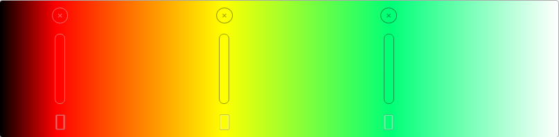

# Gradient Generator UI

> Visual and interactive gradient generator

<div style="text-align: center">
  
</div>

Library to create a gradient generator in vanilla-js with interactive user interface in html

## Installing

```bash
yarn add gradient-generator-ui
```

or

```bash
npm install gradient-generator-ui
```

Or with CDN links

```HTML
<!-- Style -->
<link rel="stylesheet" href="https://unpkg.com/gradient-generator-ui@1.0.3/dist/gradient-generator.css" crossorigin>

<!-- Script -->
<script src="https://unpkg.com/gradient-generator-ui@1.0.3/dist/gradient-generator.js" crossorigin ></script>
```

## Basic Usage

```js
const gradientRoot = document.getElementById('gradient-root');

const myColorGen = new GradientGenerator({
  mainElement: gradientRoot,
  initialColors: [
    { colorHex: '#ff0000', position: 0 },
    { colorHex: '#00ff00', position: 50 },
    { colorHex: '#0000ff', position: 100 },
  ],
});

const colors1 = myColorGen.generateColors(50);
console.log(colors1); // Generate 50 colors using the first values

myColorGen.addColors(
  { colorHex: '#fafa00', position: 80 },
  { colorHex: '#001919', position: 30 }
);

const colors2 = myColorGen.generateColors(100);
console.log(colors2); // Generate 100 colors using the first values and the news
```

see example [here](https://edisonpem.github.io/gradient-generator-ui/basicUsage/)

### Without UI Element

```js
const myColorGen = new GradientGenerator();

const colors1 = myColorGen.generateColors();
console.log(colors1); // Generate 100 colors using the default values

myColorGen.addColors(
  { colorHex: '#fafa00', position: 80 },
  { colorHex: '#001919', position: 30 }
);

const colors2 = myColorGen.generateColors(100);
console.log(colors2); // Generate 100 colors using the default values and the news
```

See this example [here](https://edisonpem.github.io/gradient-generator-ui/withoutUI/)

### With a UI Manager

```js
const gradientRoot = document.getElementById('gradient-root');

const myColorGen = new GradientGenerator({ mainElement: gradientRoot });
const myGenManager = myColorGen.createUIManager({ keepChanges: false });

const addBtn = document.getElementById('add');
addBtn.addEventListener('click', () => {
  myGenManager.setAddMode();
});

const cancelBtn = document.getElementById('cancel');
cancelBtn.addEventListener('click', () => {
  myGenManager.cancelAddMode();
});
```

See this example [here](https://edisonpem.github.io/gradient-generator-ui/withManager/)

## API

### GradientGenerator

- Constructor Options:

  - `mainElement` (_default:_ null) - pass a empty HTMLElement root of the gradient.
  - `initialColors` (_default:_ [
    { colorHex: '#ff0000', position: 10 },
    { colorHex: '#ffff00', position: 40 },
    { colorHex: '#00ff77', position: 70 } ]) - pass an array of objects with a hexadecimal color and relative position (0 - 100)

- `generateColors(size = 100)` - Generate the intermediate colors accord an expected number of colors generated

- `addColors(...{ colorHex, position })` - Add one or many new intermediate color with ther respective relative position

- `getGradientColors()` - Get the gradient generator colors ordered by position

- `setGradientColors([{colorHex, position}])` - Reset the gradient generator colors base

- `createUIManager(ManagerConstructorOptions)` - Get a new Generator Manager with this generator to interact with the user interface.

### GeneratorManager

- Constructor Options:

  - `generator`: GradientGenerator - Pass the generator to manage
  - `keepChanges` (_default_: true) - keep the changes on the interface in each interaction

- `activateAddMode()` - Activates the interaction with the user interface to add a new element on click on the main element

- `cancelAddMode()` - Deactivate the interaction with the user interface to add new elements

- `restoreColors()` - if `keepChanges` is false, it restores the colors of the last restore point

- `saveColors()` - Create a new restore point with current colors

## Author

Edison Peñuela – [@EdisonPeM](https://github.com/EdisonPeM/) – edisonpe961206@hotmail.com

Distributed under the MIT license. See [`LICENSE`](https://github.com/EdisonPeM/gradient-generator-ui/blob/main/LICENSE) for more information.

## Contributing

1. Fork it (<https://github.com/EdisonPeM/gradient-generator-ui/fork>)
2. Create your feature branch (`git checkout -b feature/fooBar`)
3. Commit your changes (`git commit -am 'Add some fooBar'`)
4. Push to the branch (`git push origin feature/fooBar`)
5. Create a new Pull Request
